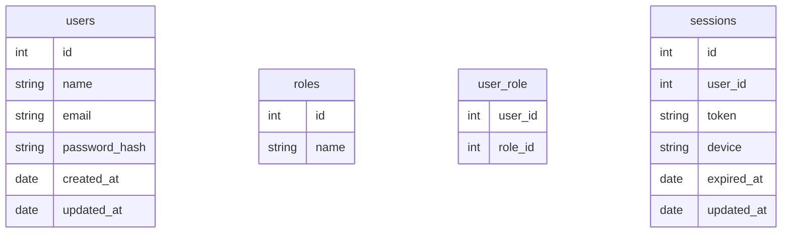

**AUTH FLOW DATABASE**

```mermaid
erDiagram
users {
    int id
    string name
    string email
    string password_hash
    date created_at
    date updated_at
}

roles {
    int id
    string name
}

user_role {
    int user_id
    int role_id
}

sessions {
    int id
    int user_id
    string token
    string device
    date expired_at
    date updated_at
}

```